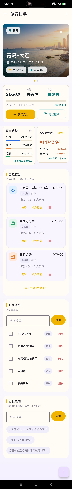
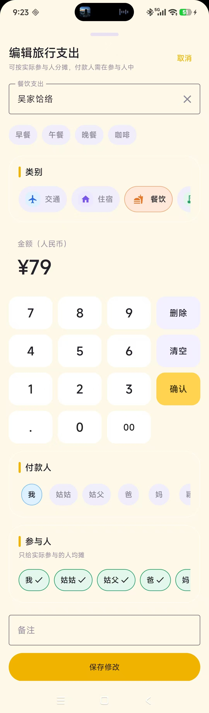

# PocketLedger

PocketLedger（口袋账本）是一款 Android 旅行助手，帮助你规划行程、管理预算和同行成员、记录旅途支出并按实际参与人进行 AA 结算，也可维护打包清单与行程提醒。应用基于 Kotlin 和 Jetpack Compose 构建，数据保存在设备本地，无需后端服务。

## 旅行助手

旅行助手围绕一次完整旅程组织信息，可同时管理多个行程，并在行程间切换。

- **行程计划**：设置行程名称、目的地、日期、预算和同行成员；编辑或删除行程，也可管理成员。
- **预算概览**：查看已花金额、预算余额、每日平均支出、行程进度和支出笔数。
- **旅行记账**：按交通、住宿、餐饮、门票、购物等类别记录支出，填写付款人、实际参与人和备注；可编辑、删除支出或标记结清。
- **按实际参与人分摊**：付款人会自动加入参与人，且不能从参与人中移除；其他参与人可按实际情况选择。AA 结算根据每笔支出的参与人和付款人汇总。
- **分类与结算**：浏览各类别支出统计、全部待结算明细；复制简洁账单或导出完整 Excel 账单。
- **出行准备**：维护可勾选的打包清单，并添加或删除行程提醒。
- **海外行程**：海外行程可使用内置汇率换算工具。

应用还支持日常支出记录与统计、分类管理，以及独立的 AA 分账活动。

## 技术栈

- Kotlin
- Android Gradle Plugin
- Jetpack Compose
- Material 3
- Kotlinx Serialization
- Coroutines / StateFlow

## 环境要求

- JDK 17
- Android Studio
- Android SDK Platform / Build-Tools / Platform-Tools
- Gradle Wrapper（项目已包含 `gradlew` / `gradlew.bat`）

更完整的环境准备说明见 [docs/android-bill-app-setup.md](docs/android-bill-app-setup.md)。

## 运行项目

在 Android Studio 中打开项目根目录，等待 Gradle 同步完成后，选择模拟器或真机运行 `app` 模块。

也可以在命令行中执行：

```powershell
.\gradlew.bat :app:compileDebugKotlin
```

生成调试安装包：

```powershell
.\gradlew.bat :app:assembleDebug
```

调试 APK 输出目录通常为：

```text
app/build/outputs/apk/debug/
```

## 项目结构

```text
.
├── app/
│   └── src/main/java/com/billapp/
│       ├── data/      # 数据模型、本地仓库和统计逻辑
│       ├── ui/        # Compose 页面、主题和 ViewModel
│       └── MainActivity.kt
├── docs/              # 开发环境和项目说明文档
├── gradle/            # Gradle Wrapper 配置
├── build.gradle.kts
├── settings.gradle.kts
└── README.md
```

## 数据存储

应用数据写入 Android 应用私有目录下的 JSON 文件，包括：

- `bills.json`
- `aa_activities.json`
- `travel.json`

这些文件属于手机或模拟器本地运行数据，不会出现在源码仓库中。

## 上传 GitHub 前检查

- 不提交 `local.properties`，其中通常包含本机 Android SDK 路径。
- 不提交 `.gradle/`、`build/`、`app/build/` 等构建缓存和产物。
- 不提交 `.idea/`、`*.iml` 等本机 IDE 配置。
- 不提交 `*.apk`、`*.aab` 等安装包产物。
- 不提交 `*.keystore`、`*.jks` 等签名文件。
- 如后续新增接口、密钥或第三方服务配置，请放入本机配置或安全的发布流程中，不要直接写入源码。

当前仓库不包含敏感接口地址或密钥。

## 截图

### 旅行助手

首页集中展示行程、预算、支出分类、AA 待结算、最近支出、打包清单和行程提醒。



新增或编辑旅行支出时，可以指定付款人并选择实际参与人；付款人始终是必选参与人。



截图统一存放于 `docs/images/` 目录。

## License

当前仓库尚未声明开源协议。上传公开 GitHub 仓库前，建议根据你的分发意图补充 `LICENSE` 文件。
